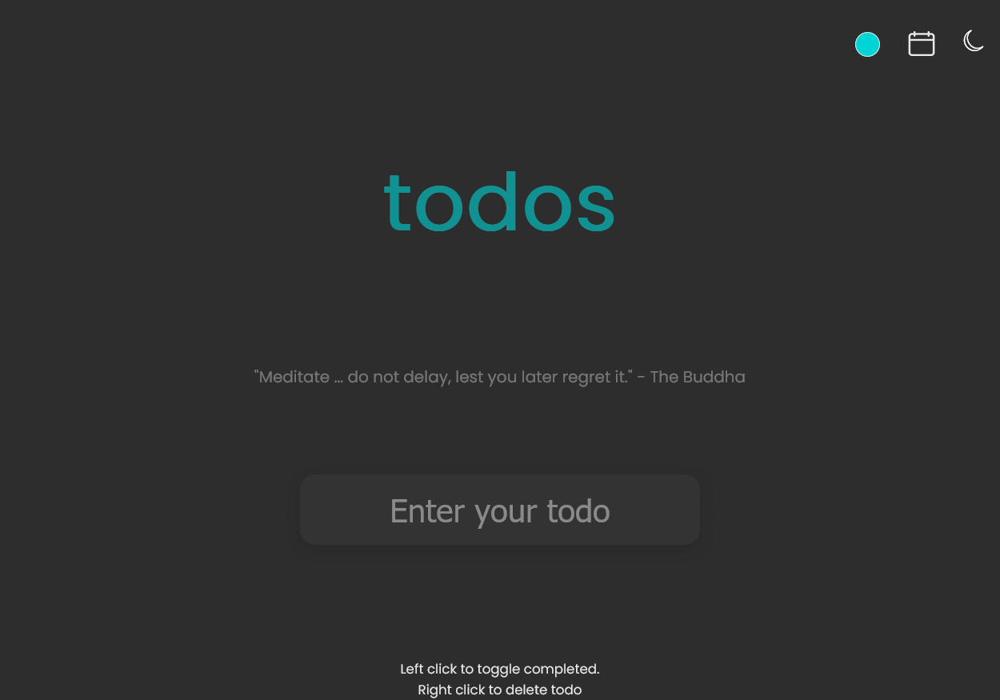

# **Simple [ToDoList](https://techcsispit.github.io/ToDoList/) Application**

This is a simple web-based Todo List application built using HTML, CSS, and JavaScript. It allows users to add, toggle, and delete tasks in a user-friendly interface.

## Features

- **Add Todo**: You can add a new todo by entering a description in the input field and pressing Enter.

- **Toggle Completed**: Click on a todo item to mark it as completed. Click it again to mark it as incomplete.

- **Delete Todo**: Right-click on a todo item to delete it from the list.

- **Local Storage**: Your todo list is saved in your browser's local storage, so your tasks will persist even after you close or refresh the page.

## Technologies Used

- **HTML**: The structure of the web page is defined in HTML.

- **CSS**: The styling of the page is done using CSS, which includes a font import from Google Fonts for the 'Poppins' font.

- **JavaScript**: The interactivity and functionality of the application are implemented using JavaScript.

## Project Files

- `index.html`: The main HTML file that defines the structure of the web page. It includes the form for adding todos and the container for displaying the todos.

- `style.css`: The CSS file for styling the web page, making it visually appealing.

- `script.js`: The JavaScript file that adds the functionality for adding, toggling, and deleting todos. It also manages local storage to persist the todos.

## Usage

To use the Todo List application, follow these steps:

1. Open `index.html` in a web browser.

2. Enter your task in the input field and press Enter to add it to the list.

3. Click on a task to mark it as completed, or click it again to mark it as incomplete.

4. Right-click on a task to delete it.

5. Your tasks will be saved in the browser's local storage, so you can access them even after closing or refreshing the page.

## Contributions

This is a simple project, but you're welcome to contribute to it by improving the user interface, adding new features, or fixing any issues you encounter. Feel free to fork the repository and submit pull requests.

## Credits

- This project was created as a simple example by a developer (you can include your name or GitHub username here).

- @CODEX108 for the UI redesign and making the site more accessible on mobile devices.

- @Enayut and @CYCLOP5 for the quotes feature.

- @mansidhamne for the calendar feature. 

- @Oreniscool for dark mode, themes, UI improvements and bug fixes.

- @piyushr6 for UI improvements.

- The 'Poppins' font used in the project is provided by Google Fonts.

Thank you for using and contributing to this Todo List application!
